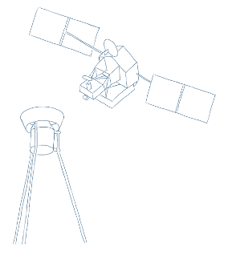

    

# mfgp

Multi-Fidelity Gaussian Processes (MFGP) applied to downscaling sparse climatic data.

Tazi, K., Orr, A., Hernandez-González, J., Hosking, S. and Turner, R.E., 2023. Downscaling precipitation over High Mountain Asia using Multi-Fidelity Gaussian Processes: Improved estimates from ERA5. _EGUsphere_, 2023, pp.1-33.
